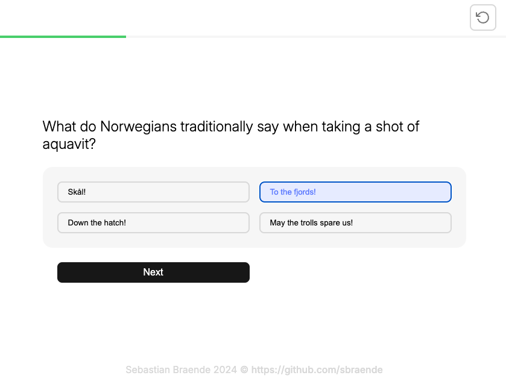

# Norway Fun Facts Quiz

Test your knowledge about Norwegian culture, history, and quirky facts in this engaging quiz game!

Published website: https://sbraende-quiz.netlify.app

## Features

- **Responsive Design**: Optimized for various screen sizes to ensure a seamless experience across devices.
- **Vanilla HTML, CSS, and JavaScript**: Built from scratch with no external frameworks.
- **Simple and Fun**: Easy to use, with clean visuals and straightforward functionality.

## Design Inspiration

The design of this quiz is inspired by:

- [Brilliant.org](https://brilliant.org/)
- [Paresh Khatri](https://dribbble.com/kpdesigns) on Dribbble

## License

This project is licensed under the [MIT License](./LICENSE.md). Feel free to use, modify, and distribute this project as per the terms of the license.
